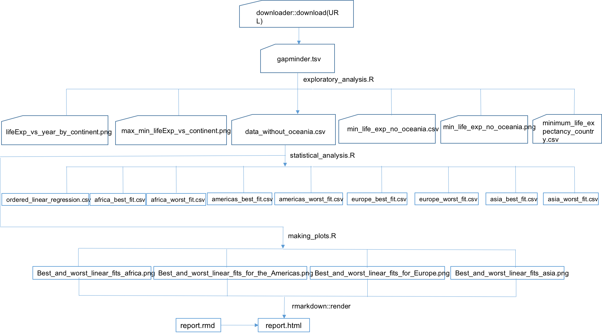

### This is the readme file for HW09: Automation and Pipelines

For this homework, I had to create a Makefile! 

Basically, the way my pipeline flows can be summarised here:

I'm sorry... it's not a great diagram, but it helps in having a bigger picture of what is happening in the makefile. 

First I created a .r file that was used to download the data from the internet to my pc. Then I explored a bit the data, and that's how exploratory.analysis.r was created. It contains some plots to see the data and also some new dataframes. In this r script you can also see that I dropped Oceania because it only has 2 countries. 

The next script I created was statistical_analysis.R that contains some more plots, and also new data frames with the best linear regression fits for every country and also for selected countries from each continent (the best and the worse).

Then I created an r script to make the final plots. This script shows the linear regression for the best and worst countries in nice plots just as jenny specified in the homework page. 

The final script contains everything and I used it to make the report in html form.
