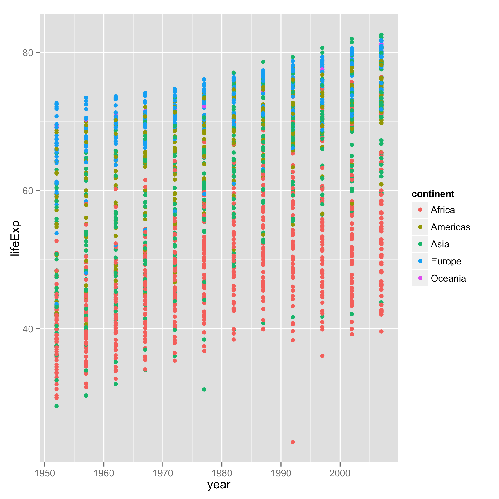
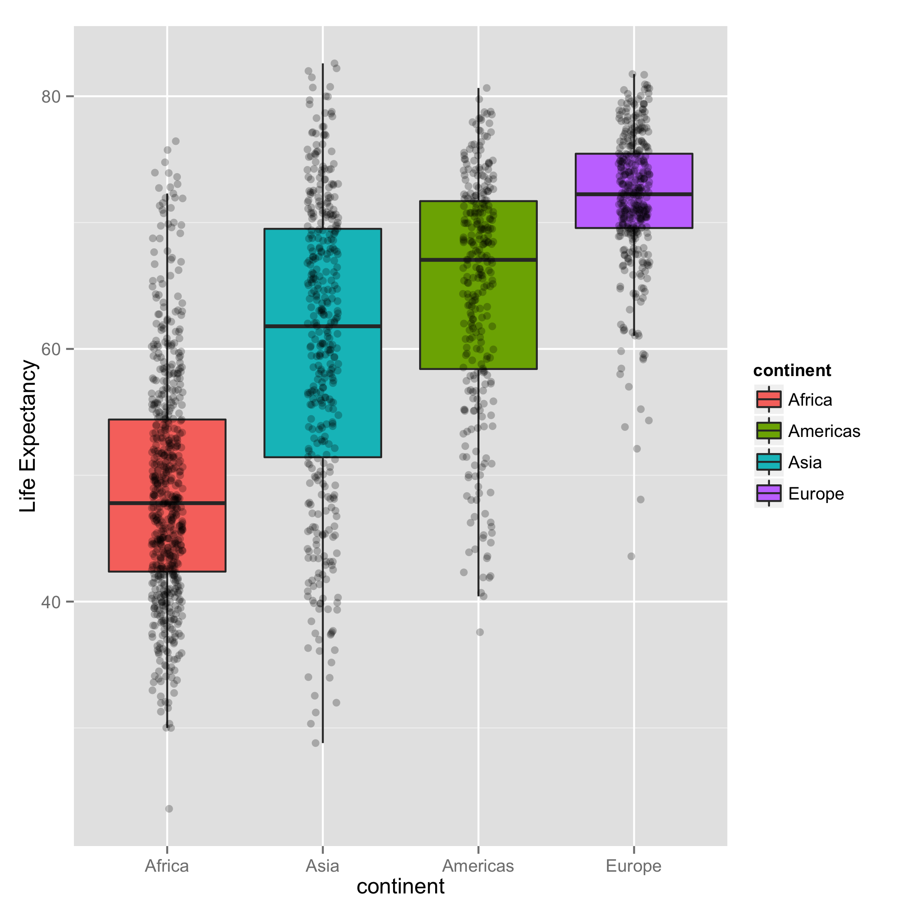
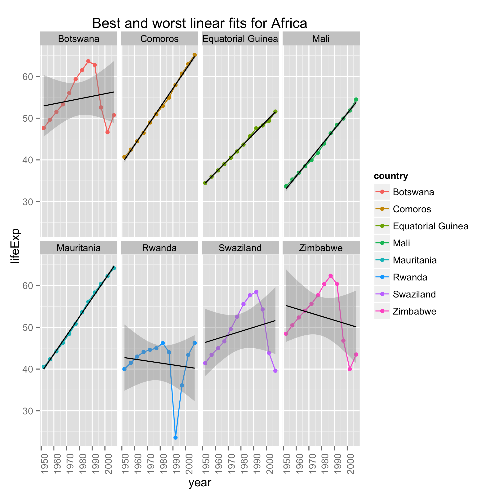
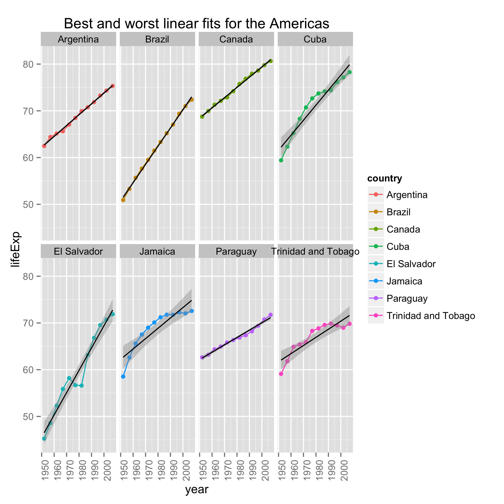
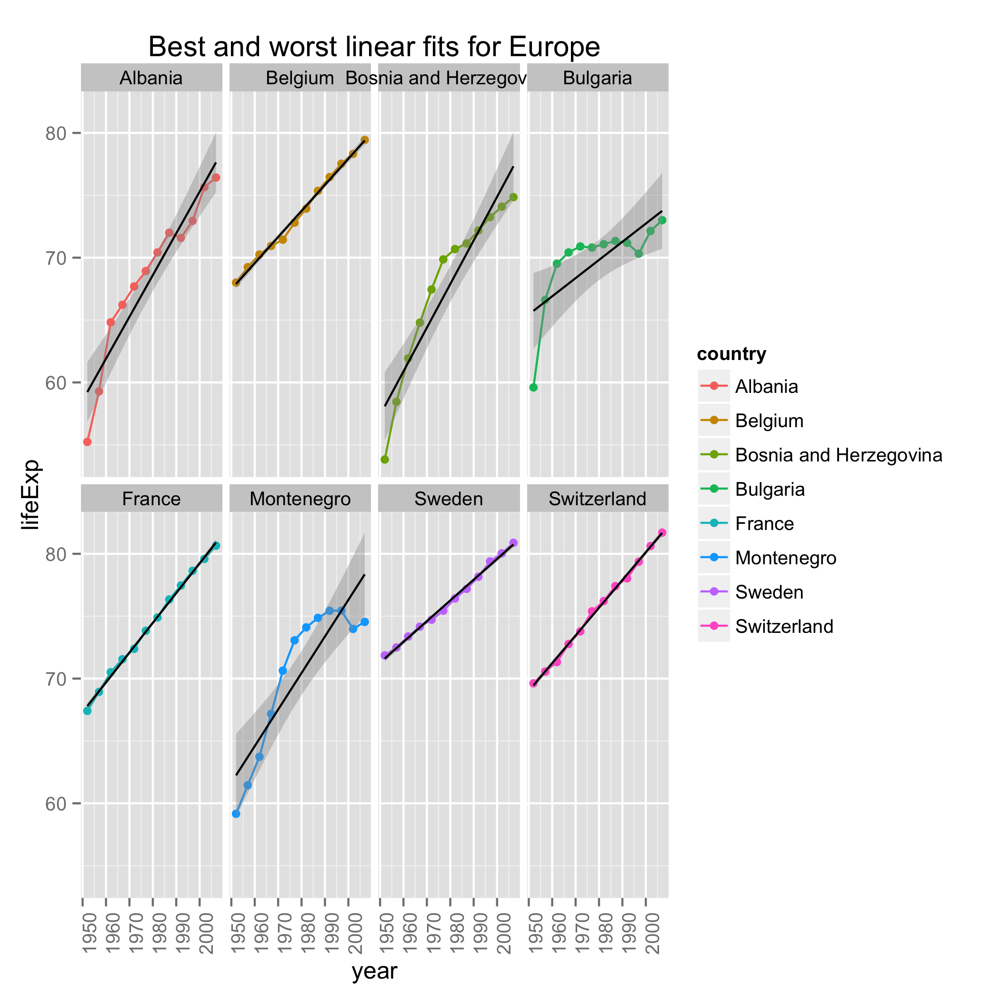

# automation and pipelines


### Perform exploratory analyses


```r
library(downloader)
library(ggplot2)
library(readr)
suppressPackageStartupMessages(library(dplyr))
```


+ Bring the data in as data frame.


```r
download(url ="https://raw.githubusercontent.com/jennybc/gapminder/master/inst/gapminder.tsv", quiet = FALSE, destfile = "gapminder.tsv")
mygapminder <- read.delim("gapminder.tsv")
```


+ Save a couple descriptive plots to file with highly informative names.


```r
plot_1 <- ggplot(mygapminder, aes(x = year, y = lifeExp)) + geom_point(aes(color = continent)) 
ggsave('lifeExp_vs_year_by_continent.png', plot = plot_1)
```

```
## Saving 7 x 5 in image
```





```r
plot_2 <- ggplot(mygapminder, aes(x = continent, y = lifeExp)) +
	scale_y_log10() +
	geom_jitter(position = position_jitter(width = 0.1, height = 0), alpha = 1/2) +
	stat_summary(fun.y = min, colour = "green", geom = "point", size = 4) +
	stat_summary(fun.y = max, colour = "purple", geom = "point", size = 4)
ggsave('max_min_lifeExp_vs_continent.png', plot = plot_2)
```

```
## Saving 7 x 5 in image
```


I will drop Oceania because as we have seen before, it only contains two countries, and I will create a new data frame that has the data without Oceania


```r
bdat <- tbl_df(droplevels(subset(mygapminder, continent != "Oceania")))
write_csv(bdat, "data_without_oceania.csv")
```


+ Reorder the continents based on life expectancy.


I will reorder using the minimum life Expectancy for each continent, and save the new file to a csv document:


```r
min_life_no_oceania <- bdat %>% group_by(continent) %>% 
	summarize(min_life_exp = min(lifeExp)) %>%
	arrange(min_life_exp)
write_csv(min_life_no_oceania, 'min_life_exp_no_oceania.csv')
```


```r
plot_3 <- ggplot(bdat, aes(x = reorder(continent, lifeExp), y = lifeExp)) +
	geom_boxplot(aes(fill = continent), outlier.shape = NA) + geom_jitter(alpha = 1/4, position = position_jitter(width = 0.1)) +
	xlab("continent") + ylab("Life Expectancy")
ggsave('min_life_exp_no_oceania.png', plot = plot_3)
```

```
## Saving 7 x 5 in image
```

```
## Warning: Removed 10 rows containing missing values (geom_point).
```

```
## Warning: Removed 1 rows containing missing values (geom_point).
```

```
## Warning: Removed 14 rows containing missing values (geom_point).
```





+ Sort the actual data in a deliberate fashion: I will take all the countries and reorder them according to the minimum life Expectancy.


```r
lifeExp_min <- bdat %>% group_by(country) %>%
	summarize(min_life_expectancy = min(lifeExp)) %>% 
	arrange(min_life_expectancy)
write_csv(lifeExp_min, "minimum_life_expectancy_country.csv")
```


### Perform statistical analyses


+ Import the data created in the first script.


```r
bdat <- read_csv("data_without_oceania.csv")
```


+ Fit a linear regression of life expectancy on year within each country. Write the estimated intercepts, slopes, and residual error variance (or sd) to file.


Using the function le_lin_fit, I can make a data frame that contains the slope, intercept and residual error for each country. I can also save that new table to my files.


```r
le_lin_fit <- function(dat, offset = 1952) {
	the_fit1 <- lm(lifeExp ~ I(year - offset), dat)
	rse <- sqrt(deviance(the_fit1)/df.residual(the_fit1))
	setNames(data.frame(t(c(coef(the_fit1), rse))), c("intercept", "slope", "rse"))
}

fit_1 <- bdat %>% 
	group_by(country, continent) %>% 
	do(le_lin_fit(.)) 

linear_regression <- tbl_df(fit_1)
lin_reg_ordered <- linear_regression %>% arrange(desc(rse))
write_csv(lin_reg_ordered, "ordered_linear_regression.csv")
```


+ Find the 3 or 4 “worst” and “best” countries for each continent. You decide the details.


I will find the 4 best and worst of each continent considering the worst or best linear fit:


```r
# Africa

africa_best_fit <- linear_regression %>% filter(continent == "Africa") %>% 
	arrange(rse) %>% 
	do(head(., n = 4))
write_csv(africa_best_fit, "africa_best_fit.csv")

africa_worst_fit <- linear_regression %>% filter(continent == "Africa") %>% 
	arrange(desc(rse)) %>% 
	do(head(., n = 4))
write_csv(africa_worst_fit, "africa_worst_fit.csv")
```


```r
# Americas

americas_best_fit <- linear_regression %>% filter(continent == "Americas") %>% 
	arrange(rse) %>% 
	do(head(., n = 4))
write_csv(americas_best_fit, "americas_best_fit.csv")

americas_worst_fit <- linear_regression %>% filter(continent == "Americas") %>% 
	arrange(desc(rse)) %>% 
	do(head(., n = 4))
write_csv(americas_worst_fit, "americas_worst_fit.csv")
```


```r
# Europe

europe_best_fit <- linear_regression %>% filter(continent == "Europe") %>% 
	arrange(rse) %>% 
	do(head(., n = 4))
write_csv(europe_best_fit, "europe_best_fit.csv")

europe_worst_fit <- linear_regression %>% filter(continent == "Europe") %>% 
	arrange(desc(rse)) %>% 
	do(head(., n = 4))
write_csv(europe_worst_fit, "europe_worst_fit.csv")
```


```r
# Asia

asia_best_fit <- linear_regression %>% filter(continent == "Asia") %>% 
	arrange(rse) %>% 
	do(head(., n = 4))
write_csv(asia_best_fit, "asia_best_fit.csv")

asia_worst_fit <- linear_regression %>% filter(continent == "Asia") %>% 
	arrange(desc(rse)) %>% 
	do(head(., n = 4))
write_csv(asia_worst_fit, "asia_worst_fit.csv")
```


Also I wrote the tables that I made to a file. So they are available


### Generate figures


+ Create a figure for each continent, including data only for the 6-8 “extreme” countries, and write to file. One file per continent, with an informative name. The figure should give scatterplots of life expectancy vs. year, facetting on country, fitted line overlaid.


```r
bdat3 <- read_csv("data_without_oceania.csv")
```


Making the plots:


```r
africa_country <- c("Equatorial Guinea", "Mauritania", "Comoros", "Mali", "Zimbabwe", "Swaziland", "Rwanda", "Botswana")
africa_plot <- ggplot(subset(bdat3, country %in% africa_country), aes(x = year, y = lifeExp, color = country)) + 
	geom_line() + 
	geom_point() +
	geom_smooth(method = "lm", color = "black") +
	facet_wrap(~ country, ncol = 4) + 
	theme(axis.text.x = element_text(angle = 90, hjust = 1)) +
	ggtitle("Best and worst linear fits for Africa")
ggsave("Best_and_worst_linear_fits_africa.png", plot = africa_plot)
```

```
## Saving 7 x 5 in image
```


Plot for Africa:





```r
america_country <- c("Canada", "Argentina", "Brazil", "Paraguay", "Jamaica", "El Salvador", "Cuba", "Trinidad and Tobago")
america_plot <- ggplot(subset(bdat3, country %in% america_country), aes(x = year, y = lifeExp, color = country)) + 
	geom_line() + 
	geom_point() +
	geom_smooth(method = "lm", color = "black") +
	facet_wrap(~ country, ncol = 4) + 
	theme(axis.text.x = element_text(angle = 90, hjust = 1)) +
	ggtitle("Best and worst linear fits for the Americas")
ggsave("Best_and_worst_linear_fits_for_the_Americas.png", plot = america_plot)
```

```
## Saving 7 x 5 in image
```


Plot for America:




```r
europe_country <- c("Sweden", "Switzerland", "France", "Belgium", "Montenegro", "Bulgaria", "Bosnia and Herzegovina", "Albania")
europe_plot <- ggplot(subset(bdat3, country %in% europe_country), aes(x = year, y = lifeExp, color = country)) + 
	geom_line() + 
	geom_point() +
	geom_smooth(method = "lm", color = "black") +
	facet_wrap(~ country, ncol = 4) + 
	theme(axis.text.x = element_text(angle = 90, hjust = 1)) +
	ggtitle("Best and worst linear fits for Europe")
ggsave("Best_and_worst_linear_fits_for_Europe.png", plot = europe_plot)
```

```
## Saving 7 x 5 in image
```


Plot for Europe:




```r
asia_country <- c("Israel", "Pakistan", "Indonesia", "Iran", "Cambodia", "Iraq", "China", "Korea, Dem. Rep.")
asia_plot <- ggplot(subset(bdat3, country %in% asia_country), aes(x = year, y = lifeExp, color = country)) + 
	geom_line() + 
	geom_point() +
	geom_smooth(method = "lm", color = "black") +
	facet_wrap(~ country, ncol = 4) + 
	theme(axis.text.x = element_text(angle = 90, hjust = 1)) +
	ggtitle("Best and worst linear fits for Asia")
ggsave("Best_and_worst_linear_fits_asia.png", plot = asia_plot)
```

```
## Saving 7 x 5 in image
```


Plot for Asia:


And that was my homework! it was really long! but the effort was worth it because I learned a lot :D
